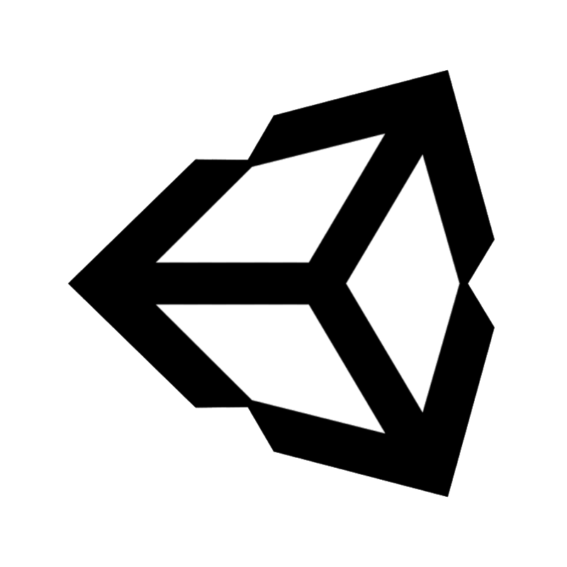

<h1 align="center">Hi 👋, I'm Alexander</h1>
<h3 align="center">High School Freshman | Aspiring Developer</h3>

Passionate about coding, building projects, and solving real problems through software.

---

## Featured Projects

**[Boat Man Shooters](https://github.com/DaNoob8157/Boat-Man-Shooters)**:  
Online multiplayer shooter game | Python | [Check it Out](https://danoob8157.github.io/Boat-Man-Shooters/)

**[Apple Music: Cracked Edition](https://github.com/DaNoob8157/Apple-Music-Cracked-Edition)**:  
Lightweight web-based Apple Music alternative | Swift | [Download](https://github.com/DaNoob8157/Apple-Music-Cracked-Edition/releases)

**[Wordle Python Edition](https://github.com/DaNoob8157/Wordle-Python-Editon)**:  
 Terminal Wordle with multiple difficulty levels | Python | One of my earliest projects, later uploaded onto GitHub

---

## 🛠️ Tech Stack

**Languages:**  
     

**Mobile:**  
 

**DevOps:**  
 

**Tools:**  
      

**Other:**  
  

---

  

---

## Currently Learning

- Fundamental Java  
- Web Development (JS/HTML/CSS)  
- UI/UX Design  
- Game Development  
- Open-Source Contribution  

---

## Let's Connect!

Feel free to explore my repositories and reach out to collaborate!

---

  Soli Deo Gloria | 1 Corinthians 10:13

